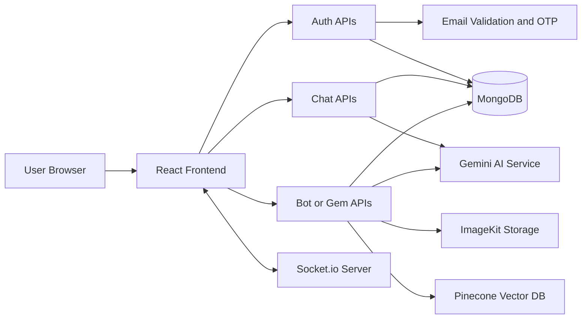
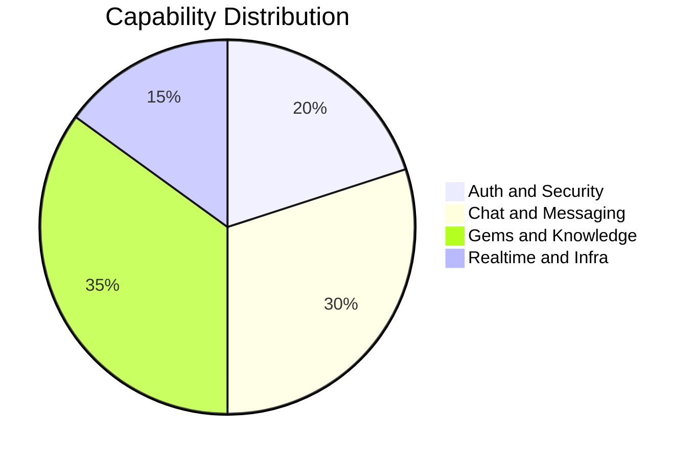
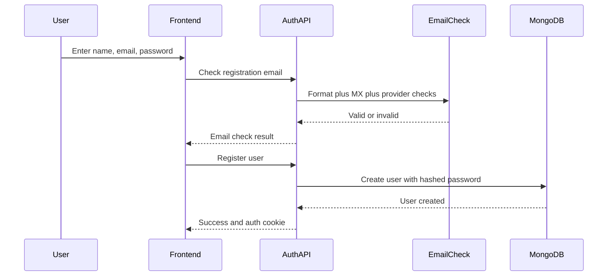
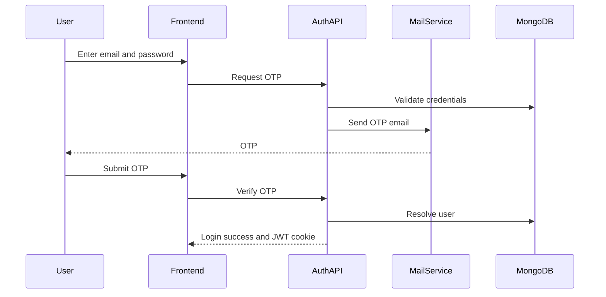
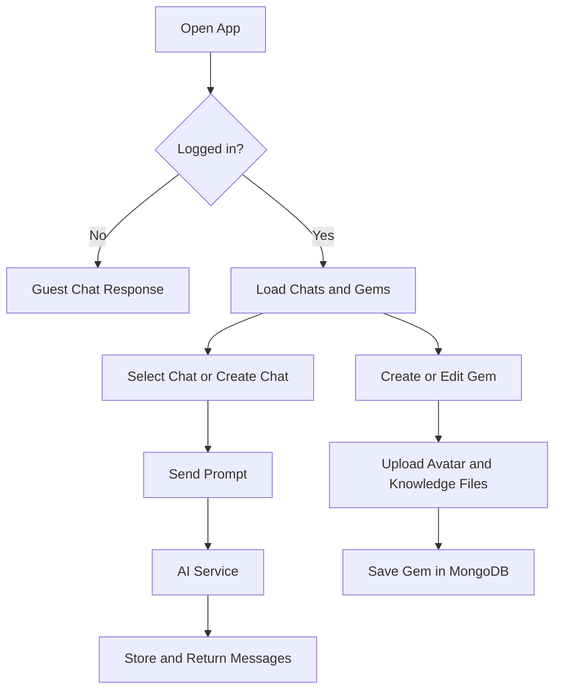

# GogoAI

A modern full stack AI chat platform with custom Gems, real time messaging, secure authentication, and knowledge powered responses.

## Live Deployment

- App and API: https://gogoai-7lzb.onrender.com/


## Why GogoAI

GogoAI is built to give users a ChatGPT style experience with extra control:

- Smart chat with AI generated responses
- Public and private custom Gems
- Real time communication using sockets
- Login security with OTP verification
- Registration email validity checks
- Optional knowledge file upload for Gem context

## Project Architecture



## Core Features

1. Authentication and Security
- Register with real email validation checks
- Login with password plus OTP verification
- JWT cookie based session auth
- Protected routes for chat and Gems

2. AI Chat Engine
- Guest chat response endpoint
- Authenticated chat creation and message history
- Chat title update and chat delete
- Request cancellation support for guest response

3. Gems Platform
- Create and edit custom AI Gems
- Public and private Gem visibility
- Private Gem access verification flow
- Per Gem Featured visibility control for public listing
- Gems Manager 3 dots actions for Featured toggle and Delete
- Avatar upload plus avatar background palette
- Knowledge files support for PDF, TXT, DOC, DOCX

4. UX and Reliability Enhancements
- AI token limit warning appears only when quota is actually hit
- Action menus render above scroll containers for better usability
- Improved auth screen stability during login and register interactions
- Deleting a Gem removes related chats, messages, and vector memory

5. Real Time Layer
- Socket server initialization with backend HTTP server
- Live chat style experience across sessions

## Feature Analytics Snapshot

### Service Surface

| Area | Approx Endpoints | Notes |
|---|---:|---|
| Auth | 6 | Register, login OTP request or verify, logout |
| Chat | 7 | Guest flow plus authenticated chat management |
| Bots or Gems | 12 | CRUD, private access, preview, avatar utilities |
| Total | 25 | Full conversational and Gem lifecycle APIs |

### Capability Mix



## End to End Flow

### Registration Flow



### Login Flow with OTP



### Chat and Gem Runtime Flow



## Tech Stack

### Frontend
- React 19
- React Router
- Redux Toolkit
- Axios
- Socket.io client
- Vite

### Backend
- Node.js
- Express
- MongoDB with Mongoose
- Socket.io
- JWT and bcrypt
- Nodemailer for OTP emails
- Gemini API for generation and embeddings
- Pinecone for vectors
- ImageKit for file storage

## Folder Overview

- Backend: API server, controllers, models, sockets, AI and storage services
- Frontend: UI pages, components, routes, Redux store, API service layer

## Quick Start

### 1. Clone and install

```bash
cd Backend
npm install

cd ../Frontend
npm install
```

### 2. Configure backend environment

Create or update Backend/.env with your keys and credentials.

Required groups:
- Database: MONGODB_URI
- Auth: JWT_SECRET
- AI: GEMINI_API_KEY and PINECONE_API_KEY
- Storage: IMAGEKIT_PUBLIC_KEY, IMAGEKIT_PRIVATE_KEY, IMAGEKIT_URL_ENDPOINT
- OTP Mail: SMTP_USER, SMTP_PASS, SMTP_SERVICE, MAIL_FROM

Optional for local development:
- ALLOW_DEV_OTP_FALLBACK=true

### 3. Run both apps

```bash
# terminal 1
cd Backend
npm run dev

# terminal 2
cd Frontend
npm run dev
```

- Production app and API run on https://gogoai-7lzb.onrender.com/
- Local development runs on your local Vite and Express ports as configured

## Deployment

- Live URL: https://gogoai-7lzb.onrender.com/
- Use this URL for app access and API base in production

## API Overview

### Auth
- POST /api/auth/register/check-email
- POST /api/auth/register
- POST /api/auth/login/request-otp
- POST /api/auth/login/verify-otp
- POST /api/auth/logout

### Chat
- POST /api/chat/guest-response
- POST /api/chat/guest-response/cancel
- POST /api/chat
- GET /api/chat
- GET /api/chat/messages/:id
- PATCH /api/chat/:id/title
- DELETE /api/chat/:id

### Gems
- POST /api/bots
- POST /api/bots/preview-response
- GET /api/bots/mine
- GET /api/bots/public
- GET /api/bots/:id
- PATCH /api/bots/:id
- PATCH /api/bots/:id/featured
- DELETE /api/bots/:id
- Plus private access and password management endpoints

## Security Notes

- Never commit real secrets into GitHub
- Rotate exposed keys immediately if leaked
- Keep ALLOW_DEV_OTP_FALLBACK disabled in production

## Roadmap Ideas

- Rate limiting for OTP endpoints
- Better analytics dashboard for chat and Gem usage
- Observability layer with request metrics and logs
- Docker and CI workflow for one command deployment

---

Built for fast AI conversations, personalized Gems, and secure user access.
