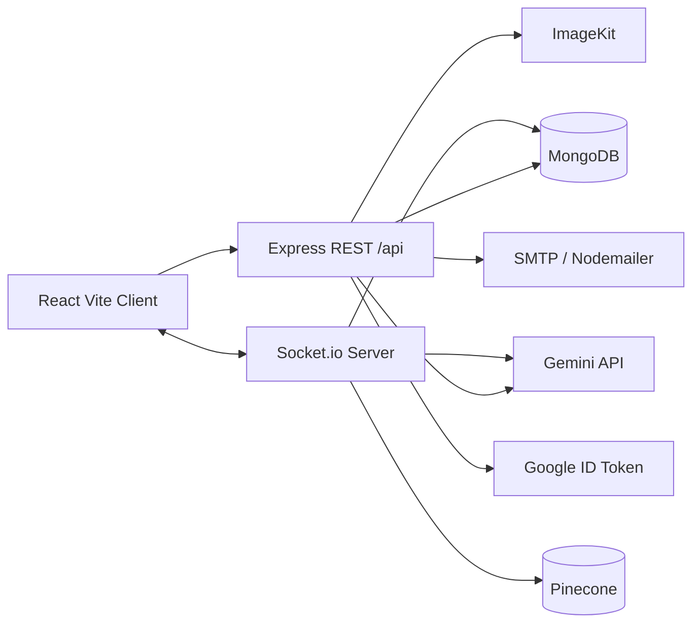
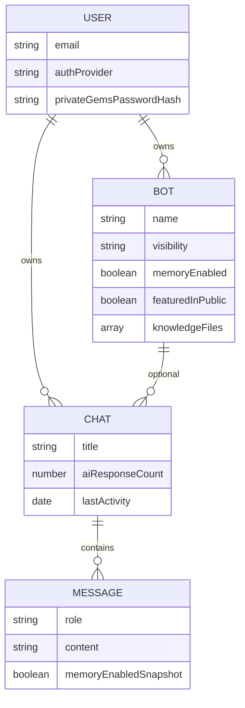
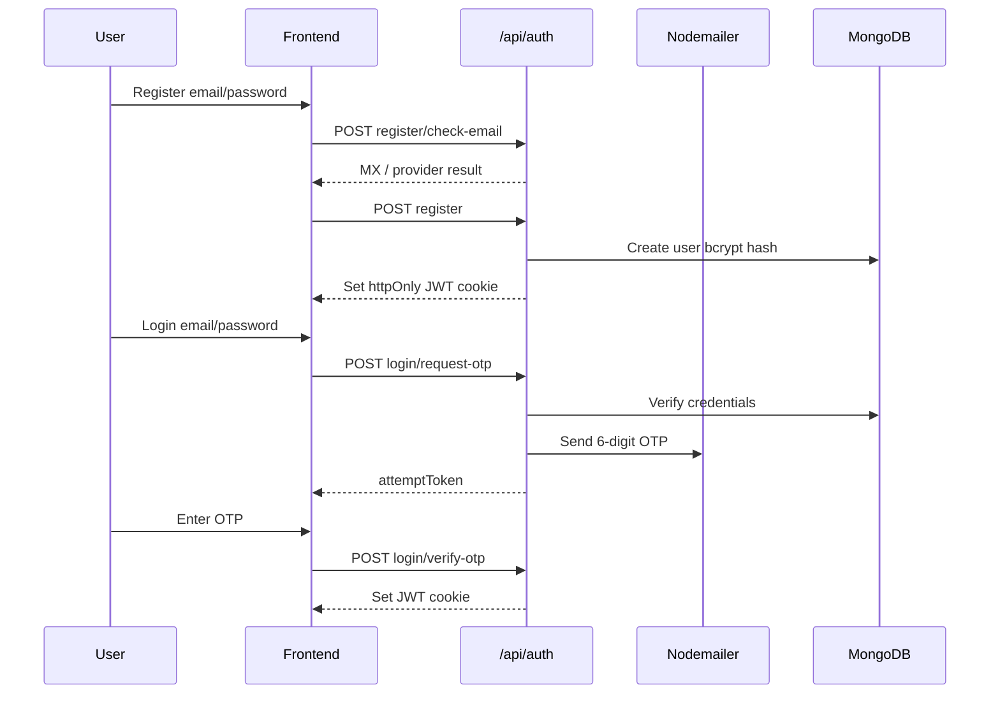
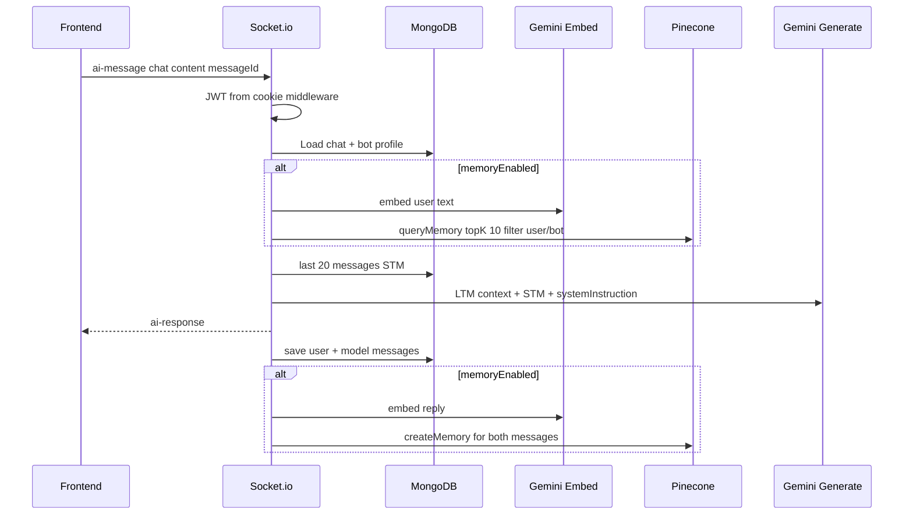
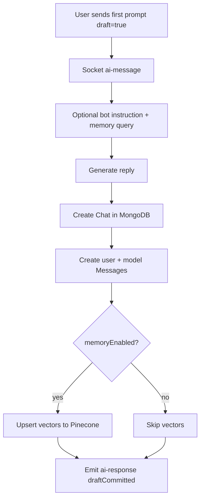
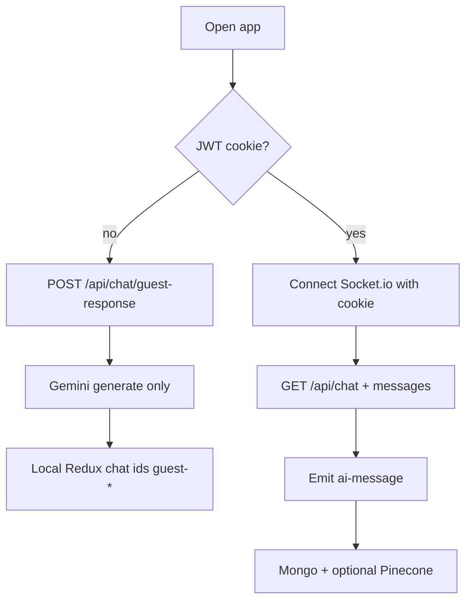
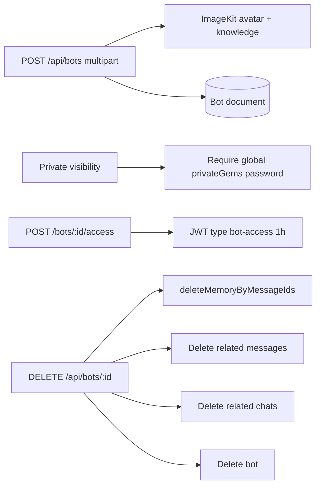

# GogoAI

## 1. Snapshot
- **One-liner:** Full-stack ChatGPT-style app with custom Gems, OTP auth, and Pinecone-backed memory.
- **Who it is for:** Users who want a personal AI chat workspace plus shareable or private custom assistants (“Gems”).
- **What success looks like:** Guests can try chat; signed-in users get persisted chats, Gem CRUD, real-time AI replies, and optional long-term memory recall.

## 2. Problem
### Pain
Generic chat demos usually stop at “call an LLM and print text.” They skip account security, conversation persistence, cancellation while the model is still generating, and any way to give an assistant a fixed persona or private knowledge.

Building a usable product means solving several hard edges at once: who is allowed to chat, how history is stored, how a custom bot stays consistent across sessions, and how past context is retrieved without stuffing every message into the prompt.

OTP-gated login, private Gem access, file uploads, and vector memory each add failure modes (SMTP outages, aborted generations, orphaned vectors, memory-off cleanup). The codebase shows those edges were treated as product requirements, not afterthoughts.

### Who suffered
- **Solo builders / learners** who want a ChatGPT-like UX with their own branding and bot personas
- **Users who need private assistants** (password-gated Gems) without shipping a separate product
- **Anyone hitting quota / latency issues** who needs cancel, guest try-before-login, and clear limit UX

### Constraints
- External AI quota (Gemini); frontend detects token/quota-style errors and shows a limit notice
- SMTP required for login OTP; optional `ALLOW_DEV_OTP_FALLBACK` for local-only recovery
- OTP sessions stored in an in-memory `Map` (not shared across multiple server instances)
- Knowledge files stored on ImageKit; runtime prompt uses file metadata (name/type/url), not full document text extraction in the socket path
- SPA and API co-hosted: Express serves `Backend/public` and `/api/*` on one HTTP server with Socket.io

### Problem statement (1 sentence)
Ship a production-shaped AI chat product where auth, custom Gems, real-time generation, and long-term memory work together—not just a single LLM demo endpoint.

## 3. Solution
### Approach
GogoAI is a React + Vite frontend and a Node/Express backend on one HTTP server. REST covers auth, chat CRUD, and Gem lifecycle; Socket.io handles authenticated AI turns so the client can stream outcomes and cancel mid-request.

Persistence uses MongoDB (users, chats, messages, bots). Long-term memory embeds messages with Gemini and stores vectors in Pinecone, filtered by `user` (and optional `bot`). Short-term context is the last 20 messages from MongoDB for the active chat.

Custom Gems are first-class bots: name, description, instructions, visibility (public/private), featured public listing, avatar + knowledge uploads via ImageKit, and a `memoryEnabled` flag. Private Gems require a user-level password (plus recovery answer) before create/unlock; access tokens are short-lived JWTs (`bot-access`, 1h).

### Core features shipped
- **Guest chat with cancel:** Try AI without an account; abort via request id (`499` on cancel).
- **JWT cookie auth + OTP login:** Password check, then email OTP (5 min, max 5 attempts); Google Sign-In also supported.
- **Registration email checks:** Format + MX; optional AbstractAPI provider verification when configured.
- **Authenticated chats:** Create/list/rename/delete chats; load message history; optional Gem attachment.
- **Real-time AI over Socket.io:** `ai-message` / `ai-response` / `ai-error` / `stop-ai` with AbortController per request.
- **Draft → commit flow:** First message can run as draft; server creates chat + messages after a successful reply.
- **Custom Gems:** CRUD, preview response, public featured listing, avatar palette, knowledge file uploads (PDF/TXT/DOC/DOCX).
- **Private Gem access:** Global private password + recovery; per-bot access token for non-owners.
- **Vector memory:** Embed + upsert/query/delete in Pinecone; skip when Gem memory is off; cleanup on Gem delete and memory-disabled chat refresh.
- **SPA hosting:** Built frontend assets served from backend `public/` for single-deploy hosting (e.g. Render).

## 4. Architecture
### System overview

### Module map (what lives where)

| Layer | Location | Responsibility |
|---|---|---|
| HTTP entry | `Backend/server.js` | DB connect, Socket.io init, listen `:3000` |
| App / routes | `Backend/src/app.js`, `routes/*` | CORS, cookies, `/api/auth`, `/api/chat`, `/api/bots`, SPA fallback |
| Auth | `auth.controller.js`, `email-validation.service.js`, `mail.service.js` | Register, OTP, Google, logout |
| Chat REST | `chat.controller.js` | Guest response, chat CRUD, memory-off cleanup on list |
| Gems | `bot.controller.js`, `storage.service.js` | Gem CRUD, private access, uploads, preview |
| Realtime AI | `sockets/socket.server.js` | Authenticated generation, STM+LTM, draft commit, stop |
| AI / vectors | `ai.service.js`, `vector.service.js` | Gemini generate/embed; Pinecone upsert/query/delete |
| Frontend | `Frontend/src/pages/home/*`, `services/*`, `store/*` | Chat UX, Redux, Axios + socket client |

### Data model (simplified)

## 5. Key flows
### Auth: register → login OTP → session cookie

### Authenticated AI turn (Socket.io + dual memory)

### Draft first message → chat commit

### Guest vs signed-in path

### Gem create / private access / delete cascade

## 6. Challenges and decisions
### Challenge: Stop generation without leaving orphan work
**What broke the naive approach:** LLM calls are long-running; users expect a Stop button.
**What was built:** Per-request `AbortController` maps on both guest HTTP (`requestId`) and sockets (`requestKey` / draft keys). Cancel marks a short-lived set so late arrivals still abort. Socket disconnect aborts all in-flight controllers for that socket.
**Tradeoff:** Cancel is cooperative with the Gemini client `signal`; aborted turns skip persistence.

### Challenge: Memory that spans chats without prompt bloat
**What broke the naive approach:** Only last-N messages loses cross-session recall; dumping all history is expensive.
**What was built:** STM = last 20 Mongo messages; LTM = Pinecone similarity query (limit 10) filtered by `user` and optional `bot`. Embeddings via `gemini-embedding-001` (768-d). Message ids are Pinecone record ids for precise delete.
**Tradeoff:** Knowledge file *contents* are not chunked into the vector index in the socket path—only metadata is injected into the bot system instruction. Full-text RAG over uploads would be a separate pipeline.

### Challenge: Memory-off must not leave junk history
**What broke the naive approach:** Toggling `memoryEnabled` left messages that should not exist.
**What was built:** Each message stores `memoryEnabledSnapshot`. `GET /api/chat` deletes messages written while memory was false for disabled-memory bots, and removes empty chats that no longer have model replies.
**Tradeoff:** Cleanup runs on chat list fetch (lazy), not as a background job.

### Challenge: First message UX vs DB consistency
**What broke the naive approach:** Creating an empty chat before the first reply littered the sidebar with abandoned threads.
**What was built:** Draft mode generates first; only on success does the server create the chat + both messages and emit `draftCommitted` with the real chat id.
**Tradeoff:** More complex client state (`isDraftChatActive`, draft message buffers) coordinated with Redux.

### Challenge: Auth that is stricter than password-only
**What broke the naive approach:** Password alone is weak for an AI product tied to email and private Gems.
**What was built:** Login is password + emailed OTP (hashed in memory, 5 min / 5 attempts). Registration validates email deliverability. Google accounts skip password. Private Gems add a second password layer at the user level.
**Tradeoff:** OTP store is process-local; horizontal scale would need Redis (or similar). SMTP misconfig fails login unless dev fallback is explicitly enabled.

### Challenge: Deleting a Gem without orphan data
**What broke the naive approach:** Soft-deleting only the bot left chats, messages, and vectors.
**What was built:** Delete loads related chats/messages, batch-deletes Pinecone ids (100 per batch), then deletes messages, chats, and the bot.
**Tradeoff:** Cascade is synchronous in the request; large Gems could make delete slower.

## 7. Tech stack
| Area | Choice |
|---|---|
| Frontend | React 19, React Router 7, Redux Toolkit, Axios, Socket.io client, react-markdown, Vite 8 |
| Backend | Node.js, Express 5, Socket.io 4, Mongoose 9 |
| Auth | JWT httpOnly cookies, bcrypt, Nodemailer OTP, Google Auth Library |
| AI | `@google/genai` — `gemini-3-flash-preview` generate, `gemini-embedding-001` embed |
| Vectors | Pinecone index `cohort-chat-gpt` |
| Storage | ImageKit (avatars + knowledge files), Multer memory upload |
| Hosting shape | Backend serves API + built SPA; production API base defaults to Render URL in frontend services |

## 8. Results
- Shipped as a deployable full-stack app (commit history includes deploy + mobile polish + memory/RAG fixes).
- ~25 REST endpoints across auth, chat, and bots, plus a socket protocol for generation and cancel.
- Guest and authenticated paths coexist without forcing signup for a first try.
- Custom Gems support public featured listing and private password access with cleanup on delete.
- Live deployment: `https://gogoai-7lzb.onrender.com` (as referenced by frontend service defaults).

## 9. What I would improve next
- Move OTP sessions to shared storage for multi-instance deploys.
- Rate-limit OTP and guest AI endpoints (already noted in repo roadmap).
- Ingest knowledge file text into Pinecone (true document RAG) instead of metadata-only context.
- Add automated tests (backend `test` script is currently a placeholder).
- Observability: structured logs and metrics around AI latency, abort rate, and Pinecone errors.

## 10. Links for portfolio UI
- **Live:** https://gogoai-7lzb.onrender.com
- **Repo:** https://github.com/masked-byte18/GogoAI
- **Cover image:** leave empty in UI; set manually later
- **Diagrams to upload:** use the Mermaid blocks in sections **4** and **5** (export to SVG/PNG from any Mermaid renderer if the portfolio UI needs static assets)
